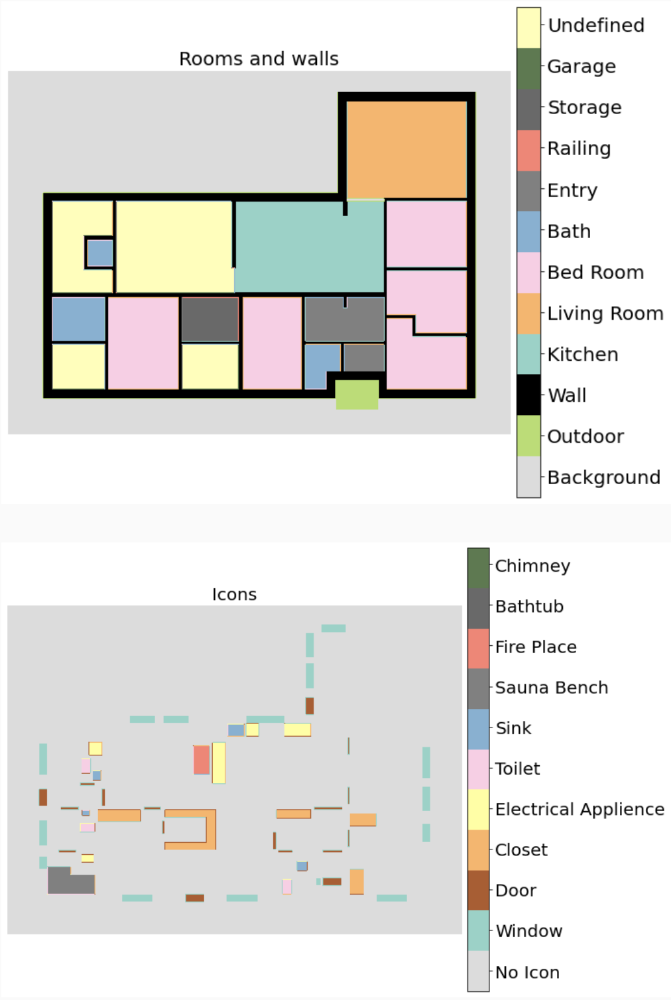

# Technical Documentation

## Dataset Overview

The Cubicasa 5k dataset is a large-scale dataset of floorplans that contains 5,000 floorplans from various building types, such as apartments, houses, and offices.

What makes this dataset particularly useful is the fact that the floorplans are not only annotated with room type labels, such as bedroom, kitchen, living room, etc., but also with icon labels, such as electrical appliance, sauna, closet, etc. This makes it a valuable resource for training and evaluating room type classification models.

For each floorplan in the dataset, there are two corresponding  2D numpy arrays (images), one for the room layer and one for the icon layer. Both arrays are of the same size and contain numerical values that represent the room type or icon label for each pixel in the floorplan.

The goal is to use this dataset to train classification models for room recognition. However, the dataset contains some rooms that are undefined, which can pose a challenge for training. I decided not to train on floor plans that contain undefined rooms. This is because the undefined room class should never be predicted.

It turns out that a large proportion of the floor plans in the dataset contain undefined rooms - around 90.5%, in fact. This means that I need to be careful about how to handle this issue, as simply discarding all floor plans with undefined rooms would result in a significant loss of data.

Therefore, I will need to find a way to salvage as much of the data as possible while still ensuring that we only train on floor plans that do not contain undefined rooms.

By addressing this issue head-on, I can ensure that my models are trained on high-quality data and are able to generalize well to new floor plans.
