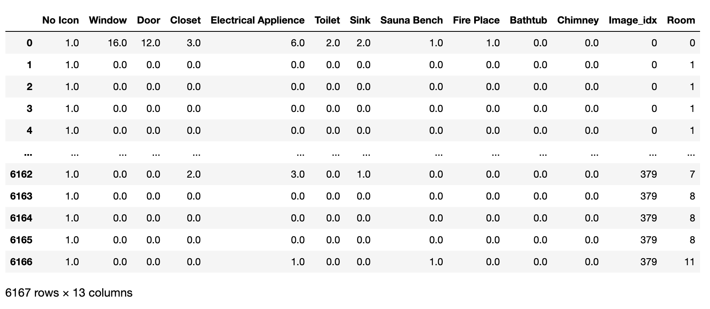

# Technical Documentation

## Dataset Overview

The Cubicasa 5k dataset is a large-scale dataset of floorplans that contains 5,000 floorplans from various building types, such as apartments, houses, and offices.

What makes this dataset particularly useful is the fact that the floorplans are not only annotated with room type labels, such as bedroom, kitchen, living room, etc., but also with icon labels, such as electrical appliance, sauna, closet, etc. This makes it a valuable resource for training and evaluating room type classification models.

For each floorplan in the dataset, there are two corresponding  2D numpy arrays (images), one for the room layer and one for the icon layer. Both arrays are of the same size and contain numerical values that represent the room type or icon label for each pixel in the floorplan.

The goal is to use this dataset to train classification models for room recognition. However, the dataset contains some rooms that are undefined, which can pose a challenge for training. I decided not to train on floor plans that contain undefined rooms. This is because the undefined room class should never be predicted.

It turns out that a large proportion of the floor plans in the dataset contain undefined rooms - around 90.5%, in fact. This means that I need to be careful about how to handle this issue, as simply discarding all floor plans with undefined rooms would result in a significant loss of data.

Therefore, I will need to find a way to salvage as much of the data as possible while still ensuring that we only train on floor plans that do not contain undefined rooms.

By addressing this issue head-on, I can ensure that my models are trained on high-quality data and are able to generalize well to new floor plans.

Let's start to salvage the data. The first step is to classify some of the unidentified rooms.

## floorplans_to_counts.ipynb

This code extracts features from floor plan images in the CubiCasa5k dataset by counting the number of occurrences of 11 different types of icons in each of the 12 different types of rooms. The output is a pandas DataFrame where each row represents an image, with columns for the count of each icon type in each room type. The code also handles cases where rooms have less than four points by storing the image index and room type in a separate errors DataFrame.

### Libraries
The code imports several libraries at the beginning, including:
- Pandas: a library for data manipulation and analysis.
- NumPy: a library for numerical computing in Python.
- OpenCV: a library for computer vision and image processing.
- Matplotlib: a library for creating data visualizations.
- Shapely: a library for working with geometric objects.
- PyTorch: a machine learning library that provides Tensors and dynamic computational graphs.
- The code also imports classes and functions from the floortrans package, which is used for loading and manipulating floor plan images. Specifically, it uses classes for loading floor plan SVG files, transforming them into tensors, and applying various image processing techniques. Additionally, it uses functions for plotting segmentation maps and polygons, as well as for splitting predictions and getting polygons from segmentation maps.

### Code Explanation
The code reads in floor plan images and labels from the CubiCasa5K dataset and performs an analysis of the overlap between room types and icon classes.

The floor plan images and labels are loaded using the FloorplanSVG class from the floortrans.loaders module. The data is then iterated through, with the isolate_class function used to select the region on the image where a particular class exists. The findContours function from the cv2 library is then used to find individual incidents of the class. The incidents are looped through and any polygons with less than four vertices are ignored. The Shapely library is used to create polygons from the vertex points, and the buffer(0) operation is used to ensure that the polygons stay valid. The polygons are then compared to find incidents of overlap between the room type and icon class, with the number of overlaps counted for each room type and icon class combination.

The analysis results are stored in a pandas DataFrame, with the number of overlaps between each room type and icon class combination recorded. The DataFrame includes an "Image_idx" column to identify which image each row of data came from, as well as a "Room" column to identify which room type each row of data corresponds to.

The code also includes error handling for polygons with less than four vertices, with any errors recorded in a separate DataFrame named "errors".

